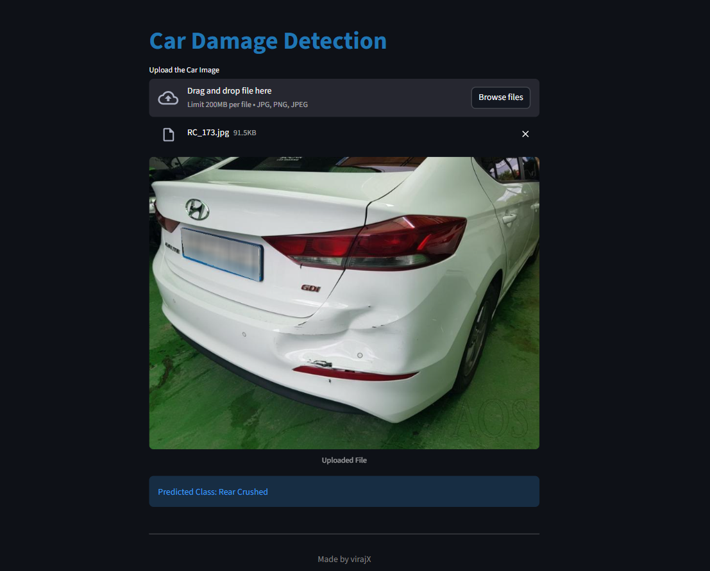
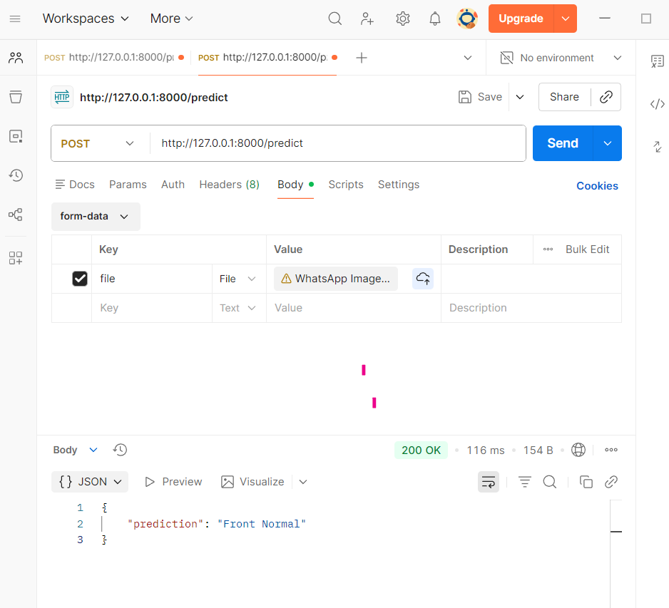

# 🚗 Car Damage Detection – Deep Learning Web App

 
 

A **deep learning–based web app** to detect **car damages** from uploaded images using **PyTorch**.  
Users can classify the severity of damage instantly via a **Streamlit** interface.

---

## 🔥 Features
- Upload any car image for **instant damage detection**  
- **PyTorch CNN model** for accurate predictions  
- Displays **classification label**  
- **Interactive Streamlit interface**  
- **FastAPI endpoint** for programmatic access to predictions  

---

## 📸 Streamlit UI Screenshot

> This is the main interface of the Car Damage Detection app, where users can upload images and view damage predictions instantly.

## ⚡ FastAPI Endpoint Screenshot

> This screenshot shows the FastAPI endpoint working in Postman, returning damage predictions for uploaded car images.

---

## 🧠 Model Overview
| Component | Description |
|----------|-------------|
| Model Type | Convolutional Neural Network (CNN) |
| Framework | PyTorch |
| Task | Car Damage Image Classification |
| Input | Car image (.jpg / .png) |
| Output | Damage level prediction |

---

## 🛠️ Tech Stack
| Area | Tools |
|------|-------|
| Deep Learning | PyTorch |
| Programming | Python |
| Web App | Streamlit |
| API | FastAPI |
| Utilities | NumPy, Pillow, scikit-learn |
